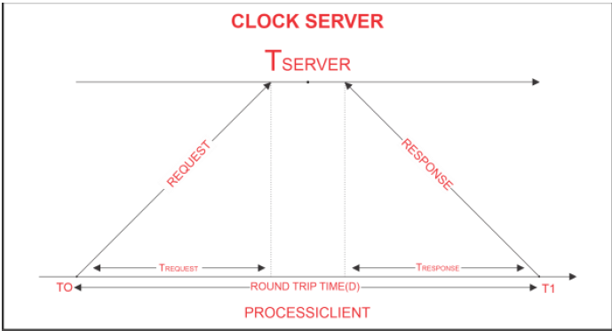

# CristianAlgorithm_UAI-503

Distributed Algorithm Final Project on Cristian Algorithm. Cristian’s Algorithm is a clock synchronization algorithm used to synchronize time with a server time by client processes. It is most effective method to sync time in networks with low latency, where Round Trip Time is short compared to the desired level of accuracy. However, it is not well-suited for use in distributed systems prone to redundancy, as these systems do not typically require high levels of accuracy.

# Technology

- Java
- Java RMI

# Algorithm Description

- The process on the client machine sends the clock server a request at time T0 for the clock time (time at the server).
- In response to the client process request, the clock server listens and responds with clock server time.
- The client process retrieves the response from the clock server at time T1 and uses the formula below to determine the synchronized client clock time.

**Formula: TCLIENT = TSERVER + (T1 - T0)/2.**

where **TCLIENT** denotes the synchronized clock time, **TSERVER** denotes the clock time returned by the server, T0 denotes the time at which the client process sent the request, and T1 denotes the time at which the client process received the response
The difference between the client's time and the actual time is at most **(T1 - T0) / 2** seconds, where T0 is the time at which the request was sent by the client and T1 is the time at which the response was received by the client. This means that the error in synchronization can be at most **(T1 - T0) / 2 seconds**, or within the range **[-(T1 - T0) / 2, (T1 - T0) / 2]**.

# Observations

We observed that the error between the actual time at client and the synchronized client time is usually within **-10 to +10 milliseconds** which is relatively low indicating that Cristian algorithm is working correctly.
